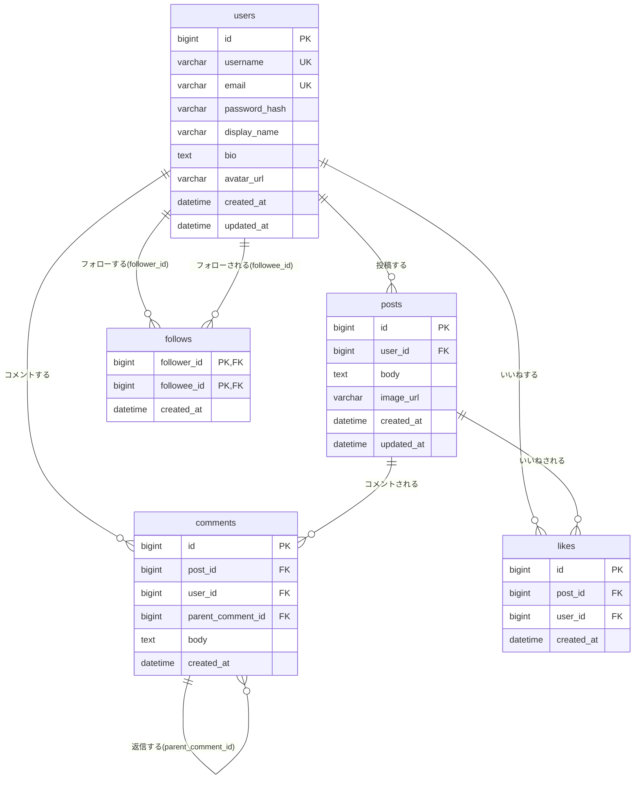

# データベース設計

## テーブル関連図

---

## テーブル定義

### users（ユーザー）

| カラム名 | 型 | 制約 | 説明 |
|----------|----|------|------|
| id | BIGINT | PK, AUTO INCREMENT | ユーザーID |
| username | VARCHAR(30) | NOT NULL, UNIQUE | ユーザー名（@handle）。検索・プロフィールURL等に使用する一意な識別子 |
| email | VARCHAR(255) | NOT NULL, UNIQUE | メールアドレス（ログインに使用） |
| password_hash | VARCHAR(255) | NOT NULL | ハッシュ化したパスワード |
| display_name | VARCHAR(50) | NOT NULL | 表示名（変更可能） |
| bio | TEXT | NULL許容 | 自己紹介 |
| avatar_url | VARCHAR(500) | NULL許容 | アイコン画像のURL |
| created_at | DATETIME | NOT NULL | 作成日時 |
| updated_at | DATETIME | NOT NULL | 更新日時 |

### posts（投稿）

| カラム名 | 型 | 制約 | 説明 |
|----------|----|------|------|
| id | BIGINT | PK, AUTO INCREMENT | 投稿ID |
| user_id | BIGINT | FK → users.id | 投稿者ID |
| body | TEXT | NOT NULL | 投稿本文 |
| image_url | VARCHAR(500) | NULL許容 | 添付画像のURL |
| created_at | DATETIME | NOT NULL | 作成日時 |
| updated_at | DATETIME | NOT NULL | 更新日時 |

### comments（コメント）

| カラム名 | 型 | 制約 | 説明 |
|----------|----|------|------|
| id | BIGINT | PK, AUTO INCREMENT | コメントID |
| post_id | BIGINT | FK → posts.id | コメント対象の投稿ID |
| user_id | BIGINT | FK → users.id | コメント投稿者ID |
| parent_comment_id | BIGINT | NULL許容, FK → comments.id | 返信元のコメントID(トップレベルコメントはNULL) |
| body | TEXT | NOT NULL | コメント本文 |
| created_at | DATETIME | NOT NULL | 作成日時 |

> コメントは編集機能を持たないため `updated_at` は持たない。`parent_comment_id` は自己参照の外部キーで、返信(ネスト)を表現する。親コメントの削除時は返信も連動して削除する(`ON DELETE CASCADE`)。

### likes（いいね）

| カラム名 | 型 | 制約 | 説明 |
|----------|----|------|------|
| id | BIGINT | PK, AUTO INCREMENT | いいねID |
| post_id | BIGINT | FK → posts.id | いいね対象の投稿ID |
| user_id | BIGINT | FK → users.id | いいねしたユーザーID |
| created_at | DATETIME | NOT NULL | 作成日時 |

> `(post_id, user_id)` にユニーク制約を設け、同一ユーザーによる同一投稿への二重いいねを防ぐ。投稿削除時はいいねも連動して削除する(`ON DELETE CASCADE`)。

### follows（フォロー関係）

| カラム名 | 型 | 制約 | 説明 |
|----------|----|------|------|
| follower_id | BIGINT | PK, FK → users.id | フォローする側のユーザーID |
| followee_id | BIGINT | PK, FK → users.id | フォローされる側のユーザーID |
| created_at | DATETIME | NOT NULL | フォロー開始日時 |

> `(follower_id, followee_id)` を複合主キーとする。`follower_id <> followee_id` を制約で保証し、自分自身のフォローを防ぐ。

---

## リレーション補足

| 関係 | 説明 |
|------|------|
| users → posts | 1人のユーザーは複数の投稿を持つ |
| users → comments | 1人のユーザーは複数のコメントを持つ |
| posts → comments | 1つの投稿は複数のコメントを持つ |
| comments → comments | 1つのコメントは複数の返信(コメント)を持つ(自己参照、`parent_comment_id`) |
| users ↔ posts（likes） | ユーザーは複数の投稿にいいねでき、投稿は複数のユーザーからいいねされる（中間テーブル `likes` で管理） |
| users ↔ users（follows） | ユーザーは複数のユーザーをフォローでき、複数のユーザーからフォローされる（自己参照の中間テーブル `follows` で管理） |

---

## 備考

- いいね数・コメント数は `posts` にカウンタ列は持たせず、`likes` / `comments` テーブルを都度集計する方式を採用する。タイムライン取得時は投稿1件ごとに集計クエリを発行せず、対象投稿IDをまとめて `WHERE post_id IN (...)` で一括集計することでN+1問題を回避する。
- ユーザー検索は `username` の部分一致で行う想定。
