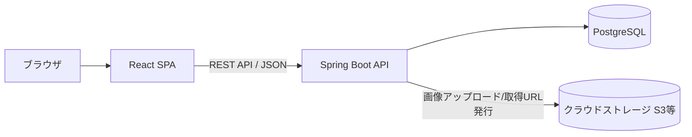
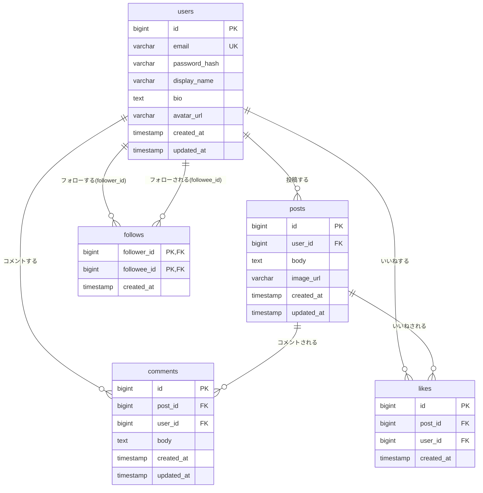

# 設計書

## アーキテクチャ

React（SPA）からバックエンドの REST API（Spring Boot）を呼び出し、データは PostgreSQL に永続化する。画像は投稿時にクラウドストレージ（S3等）へアップロードし、DB には画像の URL のみを保存する。



## 技術スタック詳細

| 層 | 技術 | 選定理由 |
|---|---|---|
| フロントエンド | React（Vite, TypeScript） | 型安全にSPAを構築でき、学習用途でも情報が豊富 |
| バックエンド | Spring Boot（Gradle）, Spring Security | Java でのAPI・認証・DBアクセスの標準的な学習に適している |
| データベース | PostgreSQL | RDBMSの学習に適し、リレーション設計を素直に表現できる |
| 画像ストレージ | クラウドストレージ（S3等） | アプリサーバーに画像を持たず、実運用に近い構成を学べる |
| 認証 | 自前実装（メール＋パスワード） | パスワードハッシュ化・セッション/トークン管理の仕組みを学べる |

## データ設計（ER図）



補足:
- `likes` は `(post_id, user_id)` にユニーク制約を設け、同一ユーザーの二重いいねを防ぐ。
- `follows` は `(follower_id, followee_id)` を複合主キーとし、`follower_id <> followee_id` を制約で保証する（自分自身のフォロー防止）。
- 投稿・コメントの件数（いいね数・コメント数）は `likes` / `comments` テーブルを都度集計するか、`posts` にカウンタ列を持たせて更新する方式のいずれかを実装時に選択する。

## API設計

| メソッド | パス | 説明 |
|---|---|---|
| POST | /api/auth/signup | 会員登録（メールアドレス・パスワード・表示名） |
| POST | /api/auth/login | ログイン |
| POST | /api/auth/logout | ログアウト |
| GET | /api/timeline | 全体タイムライン取得（全ユーザーの投稿、新着順） |
| GET | /api/timeline/following | フォロー中タイムライン取得 |
| POST | /api/posts | 投稿作成（テキスト・画像） |
| GET | /api/posts/{postId} | 投稿詳細取得（コメント含む） |
| PUT | /api/posts/{postId} | 投稿編集（本人のみ） |
| DELETE | /api/posts/{postId} | 投稿削除（本人のみ） |
| POST | /api/posts/{postId}/comments | コメント作成 |
| PUT | /api/comments/{commentId} | コメント編集（本人のみ） |
| DELETE | /api/comments/{commentId} | コメント削除（本人のみ） |
| POST | /api/posts/{postId}/likes | いいね |
| DELETE | /api/posts/{postId}/likes | いいね解除 |
| GET | /api/users/{userId} | プロフィール取得（フォロー数・フォロワー数含む） |
| PUT | /api/users/me | 自分のプロフィール編集 |
| POST | /api/users/{userId}/follow | フォロー |
| DELETE | /api/users/{userId}/follow | フォロー解除 |
| GET | /api/users/{userId}/followers | フォロワー一覧取得 |
| GET | /api/users/{userId}/following | フォロー中一覧取得 |

## 画面設計

### 画面一覧

| 画面 | 説明 |
|---|---|
| ログイン | メールアドレス・パスワードでログイン |
| 会員登録 | メールアドレス・パスワード・表示名で新規登録 |
| タイムライン | 「全体」「フォロー中」タブを切り替えて投稿一覧を表示。各投稿にいいね数・コメント数を表示 |
| 投稿詳細 | 投稿本文・画像とコメント一覧を表示。コメント投稿が可能 |
| 投稿作成 | テキスト入力と画像添付を行うモーダル/画面 |
| プロフィール | 自分・他ユーザーの表示名・自己紹介・アイコン・フォロー数/フォロワー数・投稿一覧を表示。他ユーザーの画面ではフォローボタンを表示 |
| プロフィール編集 | 表示名・自己紹介・アイコン画像を編集 |
| フォロー・フォロワー一覧 | 対象ユーザーのフォロー中/フォロワーの一覧を表示 |

### 画面遷移図

```mermaid
graph TD
    Login[ログイン] -->|未登録| Signup[会員登録]
    Login -->|ログイン成功| Timeline[タイムライン]
    Signup -->|登録成功| Timeline
    Timeline -->|投稿クリック| PostDetail[投稿詳細]
    Timeline -->|投稿作成ボタン| PostCreate[投稿作成]
    PostCreate -->|投稿完了| Timeline
    Timeline -->|ユーザー名クリック| Profile[プロフィール]
    PostDetail -->|ユーザー名クリック| Profile
    Profile -->|編集ボタン(自分のみ)| ProfileEdit[プロフィール編集]
    Profile -->|フォロー数/フォロワー数クリック| FollowList[フォロー・フォロワー一覧]
    FollowList -->|ユーザークリック| Profile
    ProfileEdit -->|保存| Profile
```
