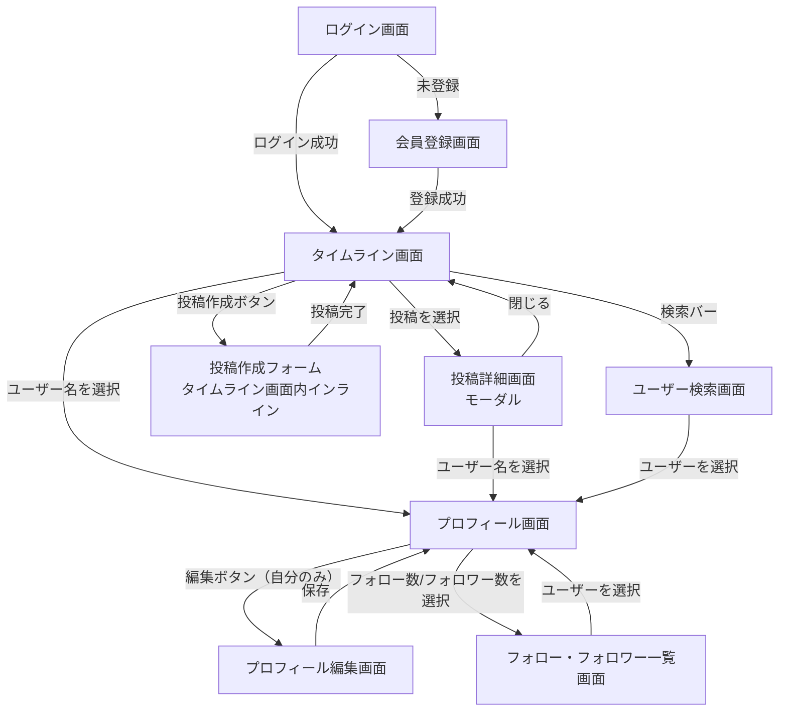

# 画面設計書

## 画面一覧

| 画面名 | 説明 |
|--------|------|
| ログイン画面 | メールアドレス・パスワードでログインする |
| 会員登録画面 | メールアドレス・パスワード・表示名・ユーザー名で新規登録する |
| タイムライン画面 | 「全体」「フォロー中」タブを切り替えて投稿一覧を表示する |
| 投稿詳細画面 | 投稿本文・画像とコメント一覧を表示し、コメントを投稿できる（モーダル） |
| 投稿作成画面 | テキスト入力を行う（タイムライン画面内のインライン展開フォーム。画像添付は未実装） |
| プロフィール画面 | 自分・他ユーザーの表示名・自己紹介・アイコン・フォロー数/フォロワー数・投稿一覧を表示する |
| プロフィール編集画面 | 表示名・自己紹介・アイコン画像を編集する |
| フォロー・フォロワー一覧画面 | 対象ユーザーのフォロー中/フォロワーの一覧を表示する |
| ユーザー検索画面 | ユーザー名（@username）でユーザーを横断検索する |

---

## 画面遷移図

### 遷移フロー



### 画面一覧と遷移元・遷移先

| 画面名 | 遷移元 | 遷移先 |
|--------|--------|--------|
| ログイン画面 | アプリ起動時（未ログイン時の初期画面） | タイムライン画面 / 会員登録画面 |
| 会員登録画面 | ログイン画面 | タイムライン画面 |
| タイムライン画面 | ログイン画面 / 会員登録画面（初期画面） | 投稿詳細画面 / プロフィール画面 / ユーザー検索画面 |
| 投稿詳細画面 | タイムライン画面 | プロフィール画面 / タイムライン画面（閉じる） |
| 投稿作成フォーム（タイムライン画面内インライン） | タイムライン画面（「+ 投稿」ボタン） | タイムライン画面（投稿完了、フォームを閉じる） |
| プロフィール画面 | タイムライン画面 / 投稿詳細画面 / ユーザー検索画面 / フォロー・フォロワー一覧画面 | プロフィール編集画面（自分のみ） / フォロー・フォロワー一覧画面 |
| プロフィール編集画面 | プロフィール画面 | プロフィール画面（保存） |
| フォロー・フォロワー一覧画面 | プロフィール画面 | プロフィール画面 |
| ユーザー検索画面 | タイムライン画面ヘッダーの検索バー | プロフィール画面 |

### 各画面の主な操作

#### ログイン画面
- メールアドレス・パスワードを入力してログイン
- 会員登録画面へのリンク

#### 会員登録画面
- メールアドレス・パスワード・表示名・ユーザー名（@username）を入力して登録
- ユーザー名の重複はエラー表示

#### タイムライン画面
- 「全体」「フォロー中」タブの切り替え
- 投稿の作成（「+ 投稿」ボタン）
- 投稿一覧の表示（本文・画像・いいね数・コメント数）
- 投稿へのいいね／いいね解除（一覧上のボタンから直接操作）
- 投稿を選択して投稿詳細画面（モーダル）を開く
- ヘッダーの検索バーからユーザー検索画面へ遷移

#### 投稿詳細画面（モーダル）
- 投稿本文・画像・いいね数・コメント数の表示
- いいね／いいね解除
- コメント一覧の表示（返信はネストして表示、階層数に制限なし）
- コメントの投稿・返信
- 自分のコメントの削除（編集機能はない）
- 投稿の編集・削除はタイムライン画面のみで行う（本画面では投稿は表示のみ）
- モーダルを閉じてタイムライン画面へ戻る

#### 投稿作成フォーム（タイムライン画面内インライン）
- 「+ 投稿」ボタンでフォームを開閉する（モーダルではなくタイムライン画面内に展開する）
- テキスト入力（必須、1〜280文字）
- 投稿ボタン（本文が空、または280文字を超える場合は非活性）
- 画像添付は未実装（[画像投稿](./features/image-upload.md)参照）

#### プロフィール画面
- 表示名・自己紹介・アイコン画像・ユーザー名の表示
- フォロー数・フォロワー数の表示（クリックでフォロー・フォロワー一覧画面へ）
- 自分のプロフィールの場合：編集ボタンを表示
- 他ユーザーのプロフィールの場合：フォロー／フォロー解除ボタンを表示
- 対象ユーザーの投稿一覧を表示

#### プロフィール編集画面
- 表示名・自己紹介・アイコン画像の編集
- 保存ボタンでプロフィール画面へ戻る

#### フォロー・フォロワー一覧画面
- 「フォロー中」「フォロワー」タブの切り替え
- 一覧からユーザーを選択してプロフィール画面へ遷移

#### ユーザー検索画面
- 検索バーにユーザー名を入力して検索（部分一致）
- 検索結果一覧（アイコン・表示名・ユーザー名）を表示
- 結果からユーザーを選択してプロフィール画面へ遷移

---

## ワイヤーフレーム

### 1. タイムライン画面

```
+--------------------------------------------------------+
| RaiseSNS      [ユーザー検索バー]          [検索]        |
+--------------------------------------------------------+
| [全体] [フォロー中]                        [+ 投稿]     |
+--------------------------------------------------------+
|  @taro   太郎                                          |
|  今日はいい天気ですね                                   |
|  [画像]                                                 |
|  ♡ 3   💬 1                                             |
+--------------------------------------------------------+
|  @hanako 花子                                           |
|  学習アプリ作ってます                                   |
|  ♡ 5   💬 2                                             |
+--------------------------------------------------------+
```

**操作：**
- タブでタイムラインの範囲を切り替え
- `[+ 投稿]` ボタンでインラインの投稿作成フォームを開閉する
- 投稿本文をクリックで投稿詳細画面（モーダル）を開く
- `♡` をクリックでいいね／いいね解除

---

### 2. 投稿詳細画面（モーダル）

```
+--------------------------------------------------------+
| 投稿の詳細                                [× 閉じる]    |
+--------------------------------------------------------+
|  @taro   太郎                                           |
|  今日はいい天気ですね                                   |
|  [画像]                                                 |
|  ♡ 3                                                    |
+--------------------------------------------------------+
|  コメント（2）                                          |
|  @hanako 花子: いいですね！              [返信] [削除]  |
|      @taro 太郎: ありがとう！                  [返信]  |
|                                                          |
|  [コメントを入力...]                        [送信]      |
+--------------------------------------------------------+
```

**操作：**
- `♡` でいいね／いいね解除
- コメント入力欄からコメントを送信
- 各コメントの `[返信]` からそのコメントへの返信を投稿（ネスト表示、階層数に制限なし）
- 自分のコメントにのみ `[削除]` ボタンを表示（編集は不可）
- 投稿本体の編集・削除はタイムライン画面で行う（本画面には表示しない）
- `[× 閉じる]` でタイムライン画面へ戻る

---

### 3. 投稿作成フォーム（タイムライン画面内インライン）

```
+--------------------------------------------------------+
| [全体] [フォロー中]                        [+ 投稿]     |
+--------------------------------------------------------+
|  +----------------------------------------------------+ |
|  | 今なにしてる？                                      | |
|  |                                                      | |
|  +----------------------------------------------------+ |
|                                       0 / 280           |
|                                          [投稿する]      |
+--------------------------------------------------------+
|  （既存の投稿一覧がこの下に続く）                        |
+--------------------------------------------------------+
```

**操作：**
- `[+ 投稿]` ボタンでタイムライン画面内にフォームを展開/収納する（モーダルは使わない）
- 本文入力（必須、1〜280文字。文字数カウンターを表示）
- `[投稿する]` で投稿を作成しフォームを閉じる（本文が空、または280文字を超える場合は非活性）
- 画像添付は未実装

---

### 4. プロフィール画面

```
+--------------------------------------------------------+
| ← 戻る                                                  |
+--------------------------------------------------------+
|  [アイコン]  太郎  @taro                    [フォロー] |
|              学習中のエンジニアです                     |
|              フォロー中 12   フォロワー 8                |
+--------------------------------------------------------+
|  投稿一覧                                                |
|  今日はいい天気ですね                                   |
|  ♡ 3   💬 1                                             |
+--------------------------------------------------------+
```

**操作：**
- 自分のプロフィールの場合、`[フォロー]` の位置に `[編集]` ボタンを表示
- 「フォロー中」「フォロワー」の数値をクリックでフォロー・フォロワー一覧画面へ遷移
- 投稿をクリックで投稿詳細画面を開く

---

### 5. ユーザー検索画面

```
+--------------------------------------------------------+
| RaiseSNS      [taro]                       [検索]       |
+--------------------------------------------------------+
|  「taro」の検索結果（2件）                                |
|                                                          |
|  [アイコン] 太郎   @taro                                 |
|  [アイコン] taro2  @taro_sub                             |
|                                                          |
+--------------------------------------------------------+
```

**操作：**
- ヘッダーの検索バーにユーザー名を入力し `[検索]` ボタンまたは Enter で検索
- 検索結果（ユーザー名の部分一致）を一覧表示
- ユーザーをクリックでプロフィール画面へ遷移

> - モーダル表示中は背景をオーバーレイで暗くする
> - レスポンシブ対応（PC・モバイルブラウザ）を前提とするが、詳細なブレークポイント設計は実装フェーズで決定する
